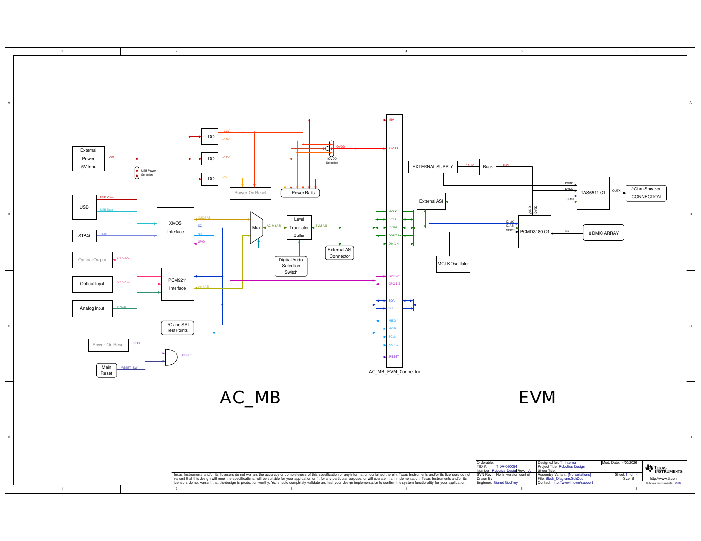
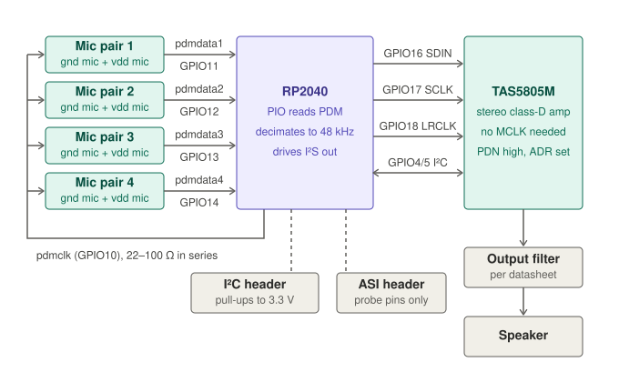
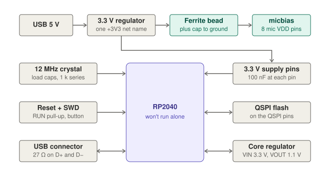

# Robot audio subsystem on the RP2040

An 8-microphone input and stereo speaker output for a robot, built around the Raspberry Pi RP2040. It is adapted from Texas Instruments' [Humanoid robotics audio subsystem reference design (TIDA-060054)](https://www.ti.com/tool/TIDA-060054).

**Status:** schematic in progress (see [To do](#to-do)). No PCB or firmware yet.

## What it does

- Listens with 8 digital (PDM) microphones. More mics let the robot work out which direction a sound comes from and filter out background noise.
- Plays audio through a stereo class-D amplifier.
- The RP2040 does the audio capture itself: its PIO block reads the mics and software filters the data to 48 kHz audio. This replaces the dedicated PDM-to-TDM converter chip used in the TI design.
- Audio goes to a computer over USB and comes back over I²S to the amp.

## What changed from the TI design

| TI reference design | This design | Why |
|---|---|---|
| PCMD3180-Q1 (8-channel PDM to TDM chip) | RP2040 PIO + software filter | Fewer parts, and you control the pipeline |
| 12.288 MHz MCLK oscillator | None | The RP2040 makes the PDM clock itself, and the amp needs no master clock |
| TAS6511-Q1 amp (automotive, 2 Ω capable) | TAS5805M | Easier to source, takes I²S directly |
| SPH9855LM4H-1 mics | SPH0141LM4H-1 | Same PDM mic family |
| AC_MB motherboard (XMOS, USB, S/PDIF, LDOs) | RP2040 USB port + one 3.3 V regulator | The motherboard was only a test rig |
| 14.4 V supply with buck and LDO | Amp supply per the TAS5805M datasheet | Different amp, different supply |

The original TI block diagram, for reference:

## Block overview

- **Mics:** 8 PDM mics in 4 pairs. Each pair shares one data line. One mic in the pair has SELECT tied to ground and the other has SELECT tied to the mic supply, so they output on opposite clock edges and don't collide.
- **Clock:** one shared PDM clock from the RP2040 goes to all mics, through a small series resistor.
- **RP2040:** reads the 4 data lines in parallel, filters each mic stream to 48 kHz audio, and sends audio out over USB or I²S.
- **Amp:** TAS5805M, configured over I²C. It drives the speaker through an output filter.
- **Headers:** an I²C header (with pull-ups) and an I²S probe header for testing.

## Pin map

| Signal | RP2040 pin | Goes to |
|---|---|---|
| PDM clock | GPIO10 | All mics (shared) |
| PDM data 1 to 4 | GPIO11 to GPIO14 | One mic pair each |
| I²S data | GPIO16 | Amp SDIN |
| I²S bit clock | GPIO17 | Amp SCLK |
| I²S frame clock | GPIO18 | Amp LRCLK |
| I²C SDA / SCL | GPIO4 / GPIO5 | Amp and I²C header |

The four data pins must stay consecutive, because the PIO program reads them as one group.

## Power and support parts

- A single 3.3 V rail, with one net name everywhere.
- The mic supply (`micbias`) comes from the 3.3 V rail through a ferrite bead and a cap, to keep regulator noise out of the mics.
- The RP2040's core regulator input goes to 3.3 V, and its output feeds the 1.1 V core rail.
- The bare RP2040 chip needs a 12 MHz crystal, QSPI flash, a reset line, and decoupling on every supply pin before it will boot.
- The amp's own supply and bootstrap parts come from the TAS5805M datasheet's typical application.

## How the audio path will work

1. The RP2040 drives the PDM clock (about 3.072 MHz, which is 64 times 48 kHz).
2. A PIO program samples all 4 data lines on both clock edges. That gives 8 mic streams.
3. DMA moves the raw bits into memory.
4. Software filters each stream (CIC decimation, then a short FIR) down to 48 kHz audio.
5. The audio goes out over USB, or over I²S to the amp for playback.

For an exact 48 kHz rate, set the system clock to 153.6 MHz so the PIO divider is a whole number.

## Known limits

- 8 channels at 3 MHz is heavy for an RP2040. Start with one pair, then add more. A Pico 2 (RP2350) gives more headroom.
- The TI design used a 2 Ω speaker load. Check the TAS5805M datasheet for the loads it supports before choosing a speaker.

## To do

- [ ] Wire the core regulator input to 3.3 V (it is currently on the 1.1 V net)
- [ ] Use one 3.3 V net name (`+3V3` and `+3.3V` are currently separate)
- [ ] Put the amp and the I²C header on the same `SCL` / `SDA` nets
- [ ] Power the second mic in each pair, and tie its SELECT pin to the mic supply
- [ ] Feed `micbias` from 3.3 V through a ferrite bead
- [ ] Add a series resistor on the PDM clock
- [ ] Wire the amp: supplies, power-down, address pin, bootstrap caps, output filter
- [ ] Finish the I²S probe header
- [ ] Add QSPI flash, reset and SWD, crystal series resistor, USB connector and resistors
- [ ] Add a power section (USB 5 V to 3.3 V regulator, amp supply)
- [ ] Add decoupling on every 3.3 V pin, and set a real value on every cap and resistor
- [ ] Write the PIO program, DMA setup and filter
- [ ] Lay out the PCB

## Credits

Based on Texas Instruments' TIDA-060054 reference design. TI's design files are under TI's own terms and are not included in this repository.
